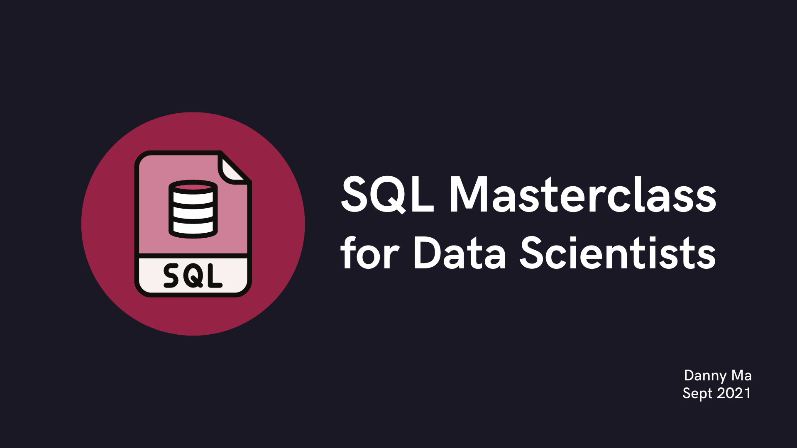

<p align="center">
    
</p>

[]()
[]()
[]()
[]()

# Langkah 6 - Perencanaan ke Depan untuk Analisis Data

[](https://github.com/datawithdanny/sql-masterclass/tree/main/course-content/step5.md)
[](https://github.com/datawithdanny/sql-masterclass/tree/main/course-content/step7.md)

# Perencanaan ke Depan

Terkadang saat membuat query SQL - kita bisa langsung melompat ke masalah awal, tapi apa yang terjadi jika kita berhenti dan merencanakan pendekatan kita terhadap masalah multi-bagian?

## Pertanyaan Portofolio Lebih Lanjut

Mari kita ambil serangkaian pertanyaan berikut ini dan uraikan pendekatan kita secara metodis sebelum kita mengungkapkan jawabannya.

**Pertanyaan 1-4**

> Berapa total nilai portofolio untuk setiap mentor pada akhir tahun 2020?

> Berapa total nilai portofolio untuk setiap region pada akhir tahun 2019?

> Berapa persentase nilai portofolio regional yang disumbangkan oleh setiap mentor pada akhir tahun 2018?

> Apakah persentase kontribusi region ini berubah ketika kita melihat portofolio Bitcoin dan Ethereum secara independen pada akhir tahun 2017?

Kita dapat melihat bahwa sebagian besar pertanyaan didasarkan pada total nilai portofolio kecuali pertanyaan terakhir - yang memerlukan kedua ticker untuk dipisahkan.

Selain itu, nilai `region` untuk setiap mentor akan menjadi penting juga untuk pertanyaan 3 dan 4.

Kita juga perlu mempertimbangkan aspek waktu untuk pertanyaan-pertanyaan ini - ini tidak akan semudah pertanyaan sebelumnya yang hanya memerlukan nilai portofolio akhir.

Untuk pertanyaan-pertanyaan ini - mari kita buat tabel dasar terlebih dahulu yang dapat kita rujuk nanti untuk menyelesaikan masalah kita!

## Buat Tabel Dasar

Kita dapat menggunakan tabel `TEMP` yang disimpan dalam skema sementara yang akan hilang setelah sesi SQL ditutup - ini sangat berguna dalam praktik karena Anda tidak selalu memiliki akses tulis ke database produksi sepanjang waktu!

Pertama mari kita buat tabel dasar kuantitas portofolio yang merangkum data kita dengan data yang diperlukan terlebih dahulu.

### Langkah 1

> Buat tabel dasar yang memiliki nama setiap mentor, `region` dan total kuantitas akhir tahun untuk setiap ticker

**Anda harus menjalankan query di bawah ini untuk menjalankan semua query berikutnya dalam tutorial ini!**

<details><summary>Klik di sini untuk melihat solusinya!</summary><br>


```sql
DROP TABLE IF EXISTS temp_portfolio_base;
CREATE TEMP TABLE temp_portfolio_base AS
WITH cte_joined_data AS (
  SELECT
    members.first_name,
    members.region,
    transactions.txn_date,
    transactions.ticker,
    CASE
      WHEN transactions.txn_type = 'SELL' THEN -transactions.quantity
      ELSE transactions.quantity
    END AS adjusted_quantity
  FROM trading.transactions
  INNER JOIN trading.members
    ON transactions.member_id = members.member_id
  WHERE transactions.txn_date <= '2020-12-31'
)
SELECT
  first_name,
  region,
  (DATE_TRUNC('YEAR', txn_date) + INTERVAL '12 MONTHS' - INTERVAL '1 DAY')::DATE AS year_end,
  ticker,
  SUM(adjusted_quantity) AS yearly_quantity
FROM cte_joined_data
GROUP BY first_name, region, year_end, ticker;
```

</details><br>

### Langkah 2

Mari kita lihat tabel dasar kita sekarang untuk melihat data apa yang kita miliki - untuk menjaga hal-hal sederhana, mari kita lihat data Abe dari tabel temp baru kita `temp_portfolio_base`

> Periksa nilai `year_end`, `ticker` dan `yearly_quantity` dari tabel temp baru kita `temp_portfolio_base` hanya untuk Mentor Abe. Urutkan output dengan nilai BTC terlebih dahulu diikuti nilai ETH

<details><summary>Klik di sini untuk melihat solusinya!</summary><br>


```sql
SELECT
  year_end,
  ticker,
  yearly_quantity
FROM temp_portfolio_base
WHERE first_name = 'Abe'
ORDER BY ticker, year_end;
```

</details><br>

|  year_end  | ticker |   yearly_quantity    |
| ---------- | ------ | -------------------- |
| 2017-12-31 | BTC    | 861.0106371411443039 |
| 2018-12-31 | BTC    | 755.1495855476883388 |
| 2019-12-31 | BTC    |  765.655338171040942 |
| 2020-12-31 | BTC    | 859.3718776810842491 |
| 2017-12-31 | ETH    | 543.2120486925716504 |
| 2018-12-31 | ETH    |  350.000100283493089 |
| 2019-12-31 | ETH    |  464.317705594980087 |
| 2020-12-31 | ETH    | 508.4673343549910666 |
<br>

Kita dapat melihat dari output di atas bahwa kuantitas tahunan persis sama dengan nilai total kuantitas portofolio yang kita butuhkan - kita perlu membuat jumlah kumulatif dari kolom `yearly_quantity` yang terpisah untuk setiap mentor dan ticker, menggunakan `year_end` sebagai kolom pengurutan.

Kita bisa melakukan ini dengan menggunakan fungsi window SQL!

### Langkah 3

Untuk membuat jumlah kumulatif - kita perlu menerapkan fungsi window!

Meskipun kita hanya akan menyentuh ini secara singkat dalam kursus ini - kursus Data With Danny [Serious SQL](https://www.datawithdanny.com/courses/serious-sql) yang lengkap membahas topik ini dan banyak konsep SQL lainnya dengan lebih mendalam!

> Buat jumlah kumulatif untuk Abe yang memiliki nilai independen untuk setiap ticker

<details><summary>Klik di sini untuk melihat solusinya!</summary><br>

```sql
SELECT
  year_end,
  ticker,
  yearly_quantity,
  /* ini adalah komentar multi-baris!
     untuk kasus ini kita sebenarnya tidak perlu first_name
     tapi kita tetap menyertakannya untuk persiapan query berikutnya! */
  SUM(yearly_quantity) OVER (
    PARTITION BY first_name, ticker
    ORDER BY year_end
    ROWS BETWEEN UNBOUNDED PRECEDING AND CURRENT ROW
  ) AS cumulative_quantity
FROM temp_portfolio_base
WHERE first_name = 'Abe'
ORDER BY ticker, year_end;
```

</details><br>


|  year_end  | ticker |   yearly_quantity    |  cumulative_quantity  |
| ---------- | ------ | -------------------- | --------------------- |
| 2017-12-31 | BTC    | 861.0106371411443039 |  861.0106371411443039 |
| 2018-12-31 | BTC    | 755.1495855476883388 | 1616.1602226888326427 |
| 2019-12-31 | BTC    |  765.655338171040942 | 2381.8155608598735847 |
| 2020-12-31 | BTC    | 859.3718776810842491 | 3241.1874385409578338 |
| 2017-12-31 | ETH    | 543.2120486925716504 |  543.2120486925716504 |
| 2018-12-31 | ETH    |  350.000100283493089 |  893.2121489760647394 |
| 2019-12-31 | ETH    |  464.317705594980087 | 1357.5298545710448264 |
| 2020-12-31 | ETH    | 508.4673343549910666 | 1865.9971889260358930 |
<br>

### Langkah 4

Sekarang mari kita terapkan fungsi window yang sama ke seluruh dataset sementara dan mulai menjawab pertanyaan kita.

Kita sebenarnya bisa `ALTER` dan `UPDATE` tabel temp kita untuk menambahkan kolom ekstra dengan perhitungan baru kita

> Hasilkan kolom `cumulative_quantity` tambahan untuk tabel temp `temp_portfolio_base`

<details><summary>Klik di sini untuk melihat solusinya!</summary><br>

```sql
-- tambah kolom bernama cumulative_quantity
ALTER TABLE temp_portfolio_base
ADD cumulative_quantity NUMERIC;

-- update kolom baru dengan data
UPDATE temp_portfolio_base
SET (cumulative_quantity) = (
  SELECT
      SUM(yearly_quantity) OVER (
    PARTITION BY first_name, ticker
    ORDER BY year_end
    ROWS BETWEEN UNBOUNDED PRECEDING AND CURRENT ROW
  )
);
```

</details><br>

Sekarang mari kita periksa apakah pembaruan pada tabel temp kita berhasil dengan memeriksa record Abe lagi!

<details><summary>Klik di sini untuk melihat solusinya!</summary><br>

```sql
-- query tabel yang telah diperbarui untuk memeriksa baris untuk Abe
SELECT
  year_end,
  ticker,
  yearly_quantity,
  cumulative_quantity
FROM temp_portfolio_base
WHERE first_name = 'Abe'
ORDER BY ticker, year_end;
```

</details><br>

| year_end   | ticker |   yearly_quantity    | cumulative_quantity  |
| ---------- | ------ | -------------------- | -------------------- |
| 2017-01-01 | BTC    | 861.0106371411443039 | 861.0106371411443039 |
| 2018-01-01 | BTC    | 755.1495855476883388 | 755.1495855476883388 |
| 2019-01-01 | BTC    |  765.655338171040942 |  765.655338171040942 |
| 2020-01-01 | BTC    | 859.3718776810842491 | 859.3718776810842491 |
| 2021-01-01 | BTC    | 479.3287662131302019 | 479.3287662131302019 |
| 2017-01-01 | ETH    | 543.2120486925716504 | 543.2120486925716504 |
| 2018-01-01 | ETH    |  350.000100283493089 |  350.000100283493089 |
| 2019-01-01 | ETH    |  464.317705594980087 |  464.317705594980087 |
| 2020-01-01 | ETH    | 508.4673343549910666 | 508.4673343549910666 |
| 2021-01-01 | ETH    |  223.204709336221616 |  223.204709336221616 |
<br>

Tunggu sebentar....itu tidak berhasil - kuantitas kumulatif dan tahunan persis sama!

Ini karena langkah `UPDATE` kita hanya memproses satu baris dalam satu waktu, yang persis apa yang tidak boleh kita lakukan dengan fungsi window!

Kita perlu membuat tabel temp tambahan dengan jumlah kumulatif kita sebagai gantinya!

**Anda harus menjalankan langkah ini agar semua query berikutnya berfungsi!**

<details><summary>Klik di sini untuk melihat solusinya!</summary><br>

```sql
DROP TABLE IF EXISTS temp_cumulative_portfolio_base;
CREATE TEMP TABLE temp_cumulative_portfolio_base AS
SELECT
  first_name,
  region,
  year_end,
  ticker,
  yearly_quantity,
  SUM(yearly_quantity) OVER (
    PARTITION BY first_name, ticker
    ORDER BY year_end
    ROWS BETWEEN UNBOUNDED PRECEDING AND CURRENT ROW
  ) AS cumulative_quantity
FROM temp_portfolio_base;
```

</details><br>

Anda dapat memastikan langkah ini berhasil dengan memeriksa output dari query ini:

```sql
SELECT * FROM temp_cumulative_portfolio_base LIMIT 20;
```

| first_name |    region     |  year_end  | ticker |    yearly_quantity    |  cumulative_quantity   |
| ---------- | ------------- | ---------- | ------ | --------------------- | ---------------------- |
| Abe        | United States | 2017-12-31 | BTC    |  861.0106371411443039 |   861.0106371411443039 |
| Abe        | United States | 2018-12-31 | BTC    |  755.1495855476883388 |  1616.1602226888326427 |
| Abe        | United States | 2019-12-31 | BTC    |   765.655338171040942 |  2381.8155608598735847 |
| Abe        | United States | 2020-12-31 | BTC    |  859.3718776810842491 |  3241.1874385409578338 |
| Abe        | United States | 2017-12-31 | ETH    |  543.2120486925716504 |   543.2120486925716504 |
| Abe        | United States | 2018-12-31 | ETH    |   350.000100283493089 |   893.2121489760647394 |
| Abe        | United States | 2019-12-31 | ETH    |   464.317705594980087 |  1357.5298545710448264 |
| Abe        | United States | 2020-12-31 | ETH    |  508.4673343549910666 |  1865.9971889260358930 |
| Alex       | United States | 2017-12-31 | BTC    |  453.4749593742834454 |   453.4749593742834454 |
| Alex       | United States | 2018-12-31 | BTC    |  447.1910423241274346 |   900.6660016984108800 |
| Alex       | United States | 2019-12-31 | BTC    |   490.959718475924108 |  1391.6257201743349880 |
| Alex       | United States | 2020-12-31 | BTC    |   444.259179847377622 |  1835.8849000217126100 |
| Alex       | United States | 2017-12-31 | ETH    |   678.274023865761511 |    678.274023865761511 |
| Alex       | United States | 2018-12-31 | ETH    | 546.83620089990823574 | 1225.11022476566974674 |
| Alex       | United States | 2019-12-31 | ETH    |  476.8692888907140746 | 1701.97951365638382134 |
| Alex       | United States | 2020-12-31 | ETH    |  621.5582550264365449 | 2323.53776868282036624 |
| Ayush      | United States | 2017-12-31 | BTC    |  794.5344541497821383 |   794.5344541497821383 |
| Ayush      | United States | 2018-12-31 | BTC    |  955.3494738695000753 |  1749.8839280192822136 |
| Ayush      | United States | 2019-12-31 | BTC    |  743.2345666894748266 |  2493.1184947087570402 |
| Ayush      | United States | 2020-12-31 | BTC    | 954.85594846498402504 | 3447.97444317374106524 |


Sekarang setelah kita mendapatkan tabel dasar kita dengan benar - mari kita mulai menjawab beberapa pertanyaan ini!

[](https://github.com/datawithdanny/sql-masterclass/tree/main/course-content/step5.md)
[](https://github.com/datawithdanny/sql-masterclass/tree/main/course-content/step7.md)
